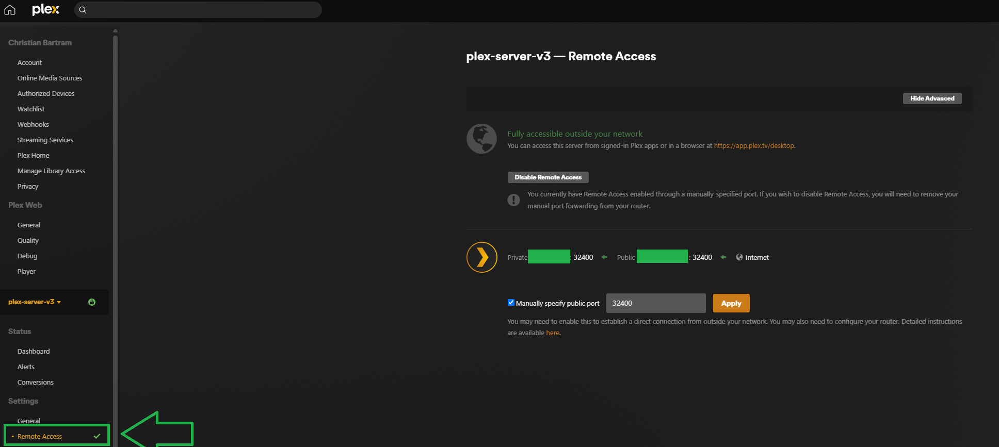

# Plex Sync

A tool which sync's a spotify song, album, or playlist to a plex media server.

## Plex Server Deployment

The plex server can be deployed via the helm chart with: 

`helm install plex ./manifests/plex -n plex`

To upgrade the chart if it's modified use:

`helm upgrade plex ./manifests/plex -f ./manifests/plex/values.yaml -n plex`

### Remote Access

Once the server is deployed make sure to go to the `Remote Access` section and enable the port `32400` as it should be 
port forwarded on the router. This allows you to access the Plex server from outside your home network.



## Adding Music

Music is stored on the PVC attached to the plex server under the `/music` directory. Music within Plex needs to be organized
in the following format:

- `Artist/Album/Song.mp3`

To add Music it's recommended to use the [SpotDL tool](https://github.com/spotDL/spotify-downloader) to download songs and playlists from
Spotify to a directory on your local device. These will be the raw MP3 files for the songs, however, they also contain the required metadata
to refine the music into the Plex required format.

Run the `reformat_music.ps1` powershell script to convert the raw MP3 files into the required directory structure. The script
is safe to run on a target directory which already has files. i.e. You added music previously and are appending additional songs in plex
format to the same directory. 

Once you have the songs in Plex format upload them to the PVC using:

`kubectl cp <local-dir> <plex-server-pod>:/music`

You can check the status of the music transfer with: 

`keti <plex-pod> -- ls /music`

> :warning: Note: the previous command will take a **long** time to complete as it tar's the file copies it and untar's in at the destination
> expect it to take an hour or two if you have 2000+ songs to copy. It gives no indication of progress or time till completion. 

## Claim Code

Within the plex server there is a claim code which needs to be refreshed when the server goes offline. The code expires
in 5 minutes and is stored as a kubernetes secret.  Head to [https://plex.tv/claim](https://plex.tv/claim) and login to generate a new code. 

`kubectl create secret generic plex-secrets --from-literal=PLEX_CLAIM=<YOUR_CLAIM_CODE> -n plex`

You can rollout the deployment to use the new secret with: 

`kubectl rollout restart deployment plex-server -n plex`

### Updating the Claim Code

To update the secret value with the new claim code use:

```shell
kubectl patch secret plex-secrets -n plex \
  --type merge \
  -p '{"stringData":{"PLEX_CLAIM":"YOUR_CLAIM_CODE"}}'

kubectl rollout restart deployment plex-server -n plex
```

## Running the tests

`pytest`

## Built With

- [Python](https://go.dev/doc/install) - Programming Language

## Contributing

Please read [CONTRIBUTING.md](CONTRIBUTING.md) for details on our code
of conduct, and the process for submitting pull requests to us.

## Versioning

We use [Semantic Versioning](http://semver.org/) for versioning. For the versions
available, see the [tags on this
repository](https://github.com/cbartram/kraken-loader-plugin/tags).

## Authors

- **C. Bartram** - *Initial Project implementation* - [cbartram](https://github.com/cbartram)

See also the list of
[contributors](https://github.com/PurpleBooth/a-good-readme-template/contributors)
who participated in this project.

## License

This project is licensed under the [CC0 1.0 Universal](LICENSE.md)
Creative Commons License - see the [LICENSE.md](LICENSE.md) file for
details

